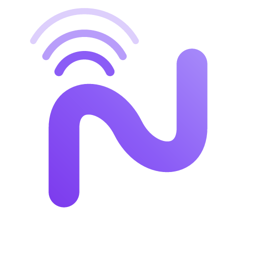

<p align="center">
  
</p>

<h1 align="center">Nootle</h1>

<p align="center">
  <strong>Your AI meeting recorder and assistant</strong>
  <br />
  Record, transcribe, and understand your meetings with local AI.
</p>

<p align="center">
  <a href="https://github.com/michellemayes/nootle/releases"></a>
  <a href="https://github.com/michellemayes/nootle/actions"></a>
  <a href="https://github.com/michellemayes/nootle/blob/main/LICENSE"></a>
  
</p>

---

Nootle captures your meetings — microphone and system audio — transcribes them in real time with speaker identification, and lets you chat with an AI about what was said. No cloud recording service needed.

## Features

- **Record everything** — capture microphone and system audio simultaneously
- **Live transcription** — speech-to-text powered by Parakeet via ONNX Runtime
- **Speaker identification** — know who said what with automatic diarization
- **AI summaries and chat** — ask questions about your meetings using your preferred LLM
- **Multiple LLM providers** — OpenAI, Anthropic, Google, Groq, or local Ollama
- **Meeting detection** — auto-detects active meeting apps and calendar events
- **MCP server** — integrate with Claude Code and other MCP-compatible tools
- **Customizable** — editable prompts and templates for summaries

## Install

Download the latest `.dmg` from [**Releases**](https://github.com/michellemayes/nootle/releases), open it, and drag Nootle to Applications.

| Chip | Download |
|------|----------|
| Apple Silicon (M1+) | `Nootle_x.y.z_aarch64.dmg` |
| Intel | `Nootle_x.y.z_x64.dmg` |

### Permissions

On first launch, Nootle will ask for:

- **Microphone** — to record your voice
- **Screen Recording** — to capture system audio from meeting apps via Core Audio
- **Calendar** — to auto-detect upcoming meetings

## Development

```bash
# Install dependencies
pnpm install

# Run in dev mode
pnpm tauri dev
```

## Testing

```bash
# Rust tests
cd src-tauri && cargo test
```

## Built With

- [Tauri 2](https://tauri.app) — native app shell
- [React 19](https://react.dev) — frontend UI
- [ONNX Runtime](https://onnxruntime.ai) — local ML inference
- [Tailwind CSS](https://tailwindcss.com) — styling

## License

[MIT](LICENSE)
