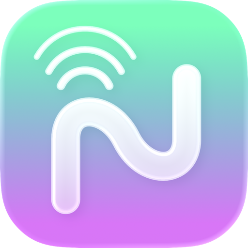
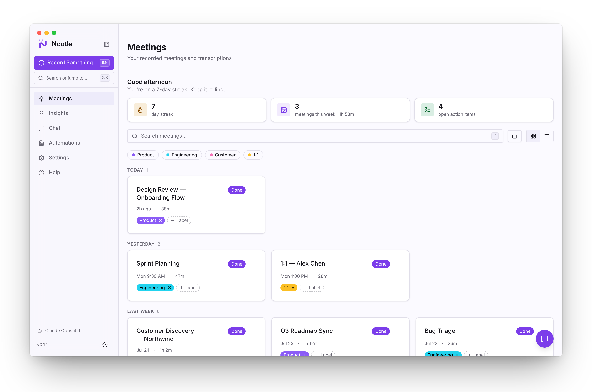
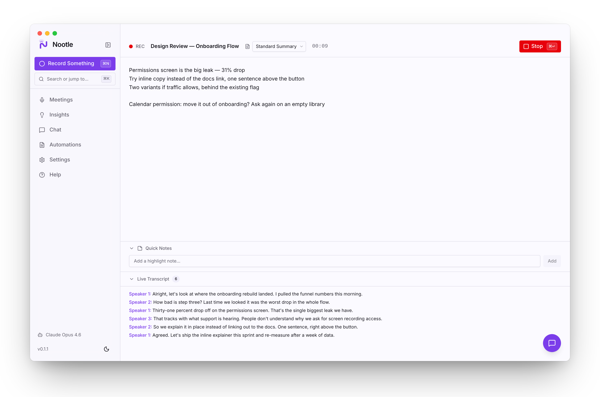
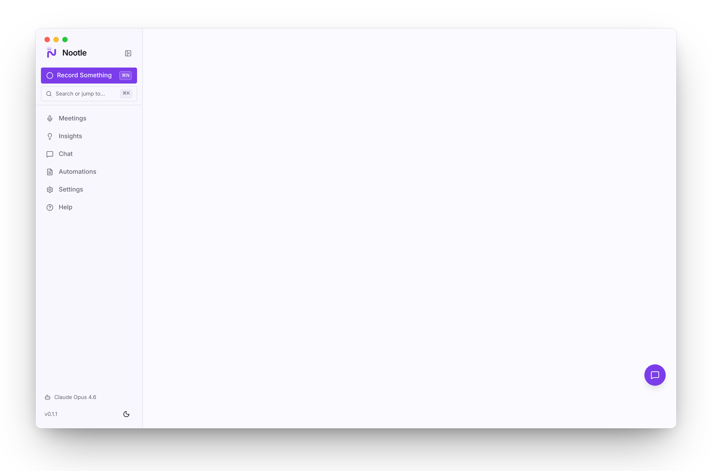
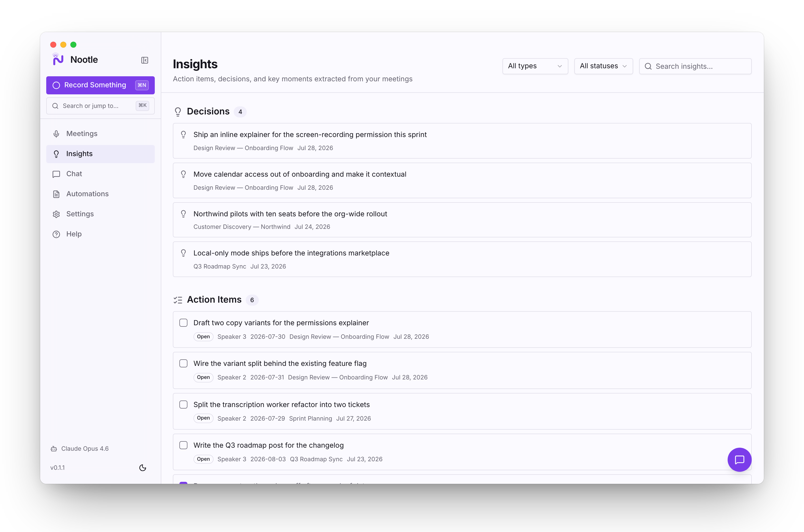
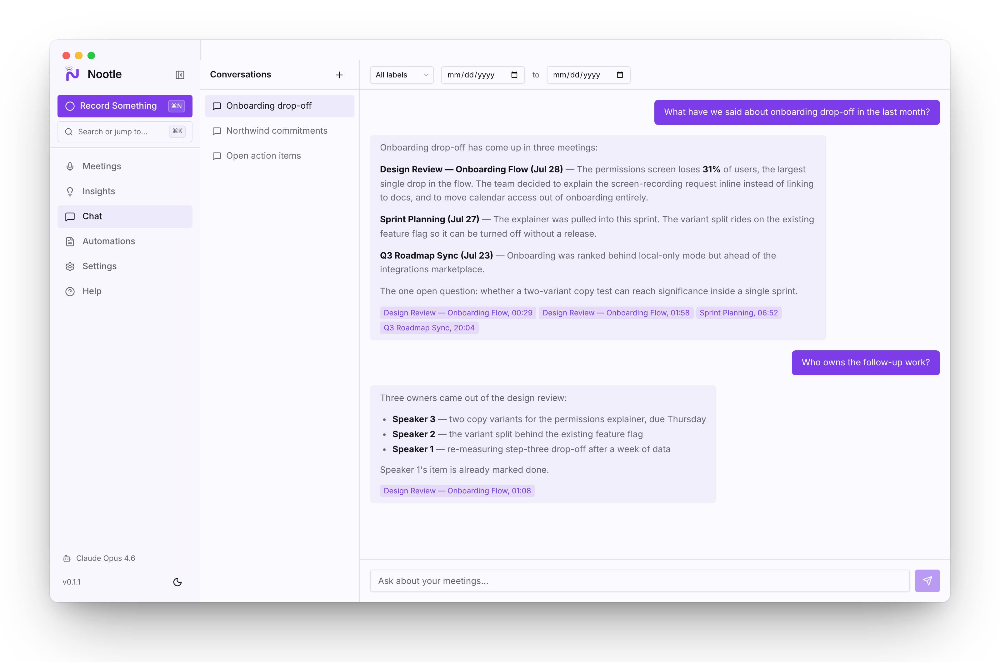
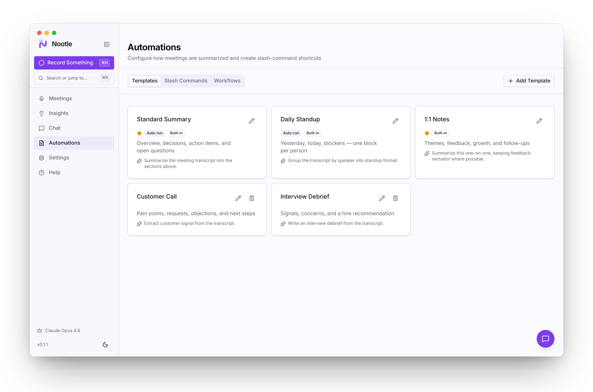

<p align="center">
  
</p>

<h1 align="center">Nootle</h1>

<p align="center">
  <strong>Your AI meeting recorder and assistant</strong>
  <br />
  Record, transcribe, and understand your meetings with local AI.
</p>

<p align="center">
  <a href="https://github.com/michellemayes/nootle/releases"></a>
  <a href="https://github.com/michellemayes/nootle/actions"></a>
  <a href="https://github.com/michellemayes/nootle/blob/main/LICENSE"></a>
  
</p>

---

Nootle captures your meetings — microphone and system audio — transcribes them in real time with speaker identification, and lets you chat with an AI about what was said. No cloud recording service needed.

> **A note on privacy.** Recording and transcription are always local — meeting audio is never uploaded, and transcripts live only on your Mac. AI summaries and chat use whichever LLM provider you point Nootle at: pick **Ollama** (with a local model) to keep everything on-device, or use OpenAI, Anthropic, Google, Groq, OpenRouter, or AWS Bedrock with your own API key. You can also route through the **Claude Code CLI** (`claude -p`) or **Codex CLI** to reuse an existing Claude or ChatGPT subscription instead of an API key. Nootle is fully local end-to-end only when you use a local AI model.

## Screenshots

<p align="center">
  <picture>
    <source media="(prefers-color-scheme: dark)" srcset="site/public/screenshots/library-dark.png" />
    
  </picture>
  <br />
  <em>Every meeting in one library — searchable, labelled, and summarized.</em>
</p>

<p align="center">
  <picture>
    <source media="(prefers-color-scheme: dark)" srcset="site/public/screenshots/recording-dark.png" />
    
  </picture>
  <br />
  <em>Record mic and system audio while the transcript builds in real time.</em>
</p>

<p align="center">
  <picture>
    <source media="(prefers-color-scheme: dark)" srcset="site/public/screenshots/meeting-dark.png" />
    
  </picture>
  <br />
  <em>Speaker-labelled transcript beside an AI summary you can jump around in.</em>
</p>

<p align="center">
  <picture>
    <source media="(prefers-color-scheme: dark)" srcset="site/public/screenshots/insights-dark.png" />
    
  </picture>
  <br />
  <em>Decisions, action items, and key moments pulled out of every meeting.</em>
</p>

<p align="center">
  <picture>
    <source media="(prefers-color-scheme: dark)" srcset="site/public/screenshots/chat-dark.png" />
    
  </picture>
  <br />
  <em>Ask questions across your whole meeting history, with citations.</em>
</p>

<p align="center">
  <picture>
    <source media="(prefers-color-scheme: dark)" srcset="site/public/screenshots/automations-dark.png" />
    
  </picture>
  <br />
  <em>Templates and workflows so the right summary runs on its own.</em>
</p>

> Screenshots use fictional demo data. See [`scripts/screenshots`](scripts/screenshots) to regenerate them.

## Features

- **Record everything** — capture microphone and system audio simultaneously
- **Live transcription** — speech-to-text powered by Parakeet via ONNX Runtime
- **Speaker identification** — know who said what with automatic diarization
- **AI summaries and chat** — ask questions about your meetings using your preferred LLM
- **Insight extraction** — automatically extract decisions, action items, and key moments
- **Multiple LLM providers** — OpenAI, Anthropic, Google, Groq, OpenRouter, AWS Bedrock, local Ollama, or your existing Claude / ChatGPT subscription via the Claude Code (`claude -p`) and Codex CLIs
- **Meeting detection** — auto-detects active meeting apps and calendar events
- **Runs in the background** — closing the window (⌘W) keeps Nootle running, so recordings and meeting detection continue; click the Dock icon to bring it back, ⌘Q to quit
- **URL scheme** — start and stop recordings from other apps or scripts via `nootle://` links (opt-in)
- **Workflows & integrations** — push summaries, action items, and notes to Slack, Notion, Confluence, Linear, GitHub, Asana, Obsidian, or email. Notion, Linear, and Confluence connect in one click through their official MCP servers. GitHub can reuse your GitHub CLI (`gh`) sign-in. Anything else takes a pasted token, and a **Get a token** button opens the right page for each service, with Slack's app and GitHub's scopes pre-filled
- **Templates** — customizable summary templates you can pick per recording, or mark auto-run so every meeting is summarized without asking (e.g. a standing template for 1:1s, standups, or interviews)
- **Semantic search** — ask questions across your entire meeting history
- **Noise cancellation** — built-in denoising for cleaner audio and transcripts
- **MCP server** — let Claude Code and other MCP clients read your meetings and set up workflows, integrations, templates, and insight types for you
- **CLI tool** — query meetings and manage automations from the terminal or scripts
- **Auto-titling** — meetings are automatically titled from transcript content
- **Keyboard-first** — ⌘K command palette to jump to any meeting or ask a question, ⌘N to start recording from anywhere, ⌘↵ to stop
- **Momentum at a glance** — workday recording streak, meetings this week, and open action items on the home screen, with a little celebration when you wrap a meeting

## Install

Download the latest `.dmg` from [**Releases**](https://github.com/michellemayes/nootle/releases), open it, and drag Nootle to Applications.

Nootle supports Apple Silicon Macs only (M1, M2, M3, M4, and M5). Intel Macs are not supported. Download `Nootle_x.y.z_aarch64.dmg`.

### Permissions

On first launch, Nootle will ask for:

- **Microphone** — to record your voice
- **Screen Recording** — to capture system audio from meeting apps via Core Audio
- **Calendar** — to auto-detect upcoming meetings

## Development

```bash
# Install dependencies
pnpm install

# Run in dev mode
pnpm tauri dev
```

### Integration sign-in

Notion, Linear, and Confluence connect with one click through each vendor's official MCP server (`mcp.notion.com`, `mcp.linear.app`, `mcp.atlassian.com`). Those servers support OAuth dynamic client registration, so Nootle registers itself the first time you connect. There's no OAuth app to create and nothing to configure at build time. Sign-in opens the vendor's consent page and catches the redirect on a one-off `127.0.0.1` port. Workflows then call the server's MCP tools, and `rmcp` refreshes the token when it expires.

GitHub can reuse a signed-in GitHub CLI (`gh auth token`). Slack and Asana connect with a pasted token, because their MCP servers require a registered app. The **Get a token** button opens the right page for each, and Slack's app setup comes pre-filled. Every service still accepts a pasted token.

## CLI Tool

`nootle-cli` is a standalone command-line tool for querying your meeting data and managing automations. It reads and writes the Nootle database directly — the app doesn't need to be running.

```bash
# Build and install
cargo install --path src-tauri --bin nootle-cli

# List meetings
nootle-cli meetings list

# Search transcripts
nootle-cli search "quarterly review"

# List open action items
nootle-cli actions list --status open
```

Output is JSON by default. Add `--pretty` for human-readable formatting. See `nootle-cli --help` for all commands.

### Automations

Agents and scripts can set up the same automations as the app: integrations, workflows, summary templates, and insight types. Input is validated, and errors list what's allowed.

```bash
# What can be automated: integration types, actions, and their fields
nootle-cli catalog

# Connect Slack. Credentials can come from stdin or @file to keep them out of shell history.
echo '{"bot_token":"xoxb-..."}' | nootle-cli integrations create --type slack --credentials -

# Create a workflow that posts summaries to #eng
nootle-cli workflows create --name "Post to #eng" --integration <integration-id> --set channel=#eng

# Run it on a meeting now
nootle-cli workflows run <workflow-id> --meeting <meeting-id>

# Summarize every new meeting with a custom template
nootle-cli templates create --name "1:1" --section Wins --section Blockers --auto-run

# Extract a custom insight type from every transcript
nootle-cli insight-types create --name Risk --prompt "Risks or concerns someone raised" --icon alert-triangle
```

Credentials are stored locally and never printed. If the app is open, reopen the page to see changes made from the CLI.

### Claude Code Skill

Install the skill so Claude can query your meetings and manage automations:

```bash
claude skill add --global --file "$(dirname $(which nootle-cli))/../skills/nootle-cli.md"
```

## MCP Server

Run the app binary with `--mcp` to use Nootle as an MCP server (Settings → About shows the exact command for your install):

```bash
claude mcp add nootle -- /Applications/Nootle.app/Contents/MacOS/nootle --mcp
```

Besides reading meetings and transcripts, the server has tools to list, create, update, run, and delete workflows, integrations, summary templates, and insight types, so you can ask an agent things like *"Set up a workflow that posts meeting recaps to #eng"* and it does the setup for you.

## URL Scheme

Other apps and scripts can control recording with `nootle://` links. This is off by default. Turn on **Settings → Recording → Allow URL control** first.

```bash
open "nootle://record/start?title=Staff%20sync"   # no-op if already recording
open "nootle://record/stop"
open "nootle://record/toggle"
open "nootle://record/status"
open "nootle://permissions/screen"                # prompt for Screen Recording access
open "nootle://permissions/status"
```

Nootle shows a notification whenever a link starts or stops a recording, or fails.

## Testing

```bash
# Rust tests
cd src-tauri && cargo test
```

## Built With

- [Tauri 2](https://tauri.app) — native app shell
- [React 19](https://react.dev) — frontend UI
- [ONNX Runtime](https://onnxruntime.ai) — local ML inference
- [Tailwind CSS](https://tailwindcss.com) — styling

## License

[MIT](LICENSE)
